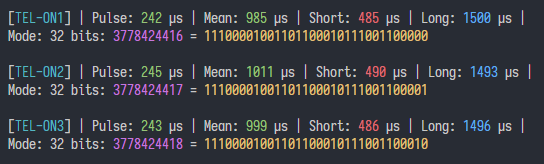

# RFSniffer Decoder

Analyzing the timings of different 433 mhz radio frequencies can be challenging and tedious work. This project aims to simplify that process by determining signal averages and sequences with a little math and guesswork. Initially this project was created to retrieve which codes were sent by the RF controllers to that they could be used by [@milaq/rpi-rf](https://github.com/milaq/rpi-rf/) in [Home Assistant](https://www.home-assistant.io/integrations/rpi_rf/).

## Installation

Git clone or download as zip this project. Open the location in a terminal and run:

```bash
npm install
```

## Usage

You will need a raw dump in the format of input name followed a sequence of timings (only the first number is used):

```
button1
  0.00254 0
  0.01262 1
  0.00273 0
  0.01222 1
  ...
button2
  0.00248 0
  0.01222 1
  0.00246 0
  0.01253 1
  ...
```

This can be fetched using the library over at [@jderehag/rpi-rfsniffer](https://github.com/jderehag/rpi-rfsniffer) and a GPIO attached RF receiver such as an `MX-RM-5V` attached to a raspberry pi (careful to not send 5V, but 3.3V to the GPIO pin). Install following the instructions and then start storing inputs running the record command:

```bash
rfsniffer record button1
```

_Use the --help flag to learn what options exist_

When you are satisfied that the inputs have been recorded, dump the raw data to a text file:

```bash
rfsniffer -v dump > codes.txt
```

and transfer it to the machine running this decode project, e.g from a local machine run:

```bash
scp user@host:/path/to/codes.txt /path/to/decoder
```

Final step is to run the decoder and fine tune the arguments.

```bash
npm start [-- --flags value]
```

This should give you an output in the following format:



If some of the inputs are faulty, either incorrect number of bits, bad averages, or decimal not sequencing, try retraining the sniffer using the same `record` command as earlier for that input. Another alternative is to fine tune the analysis using some of argument the flags below.

## Flags

All flags are optional.

### path

Default location to resolve file from

```
--path string
```

_Default:_ `'codes.txt'`

---

### limit

Number of signals before cutoff 128 \* 6 + margin

```
--limit number
```

_Default:_ `800`

---

### unit

Unit the timings are specified in

```
--unit s|ms|us|μs
```

_Default:_ `'s'`

---

### deviation

Noise deviation

```
--deviation number
```

_Default:_ `1.1`

---

### pause

Factor which to consider modulation as a pause between sequences: `short + long * pause`

```
--pause number
```

_Default:_ `4`

---

### sync

Factor which to consider modulation as a sync signal: `short + long * sync`

```
--sync number
```

_Default:_ `1.5`

---

### bits

Filter out sequences not matching bits length

```
--bits number
```

_Default:_ `32`

---

### me

Bits use Manchester encoding `0 => 01` and `1 => 10`

```
--me boolean
```

_Default:_ `true`

---

### input

Debug specific input only with increased detail or summary of all

```
--input all|string
```

_Default:_ `'all'`
